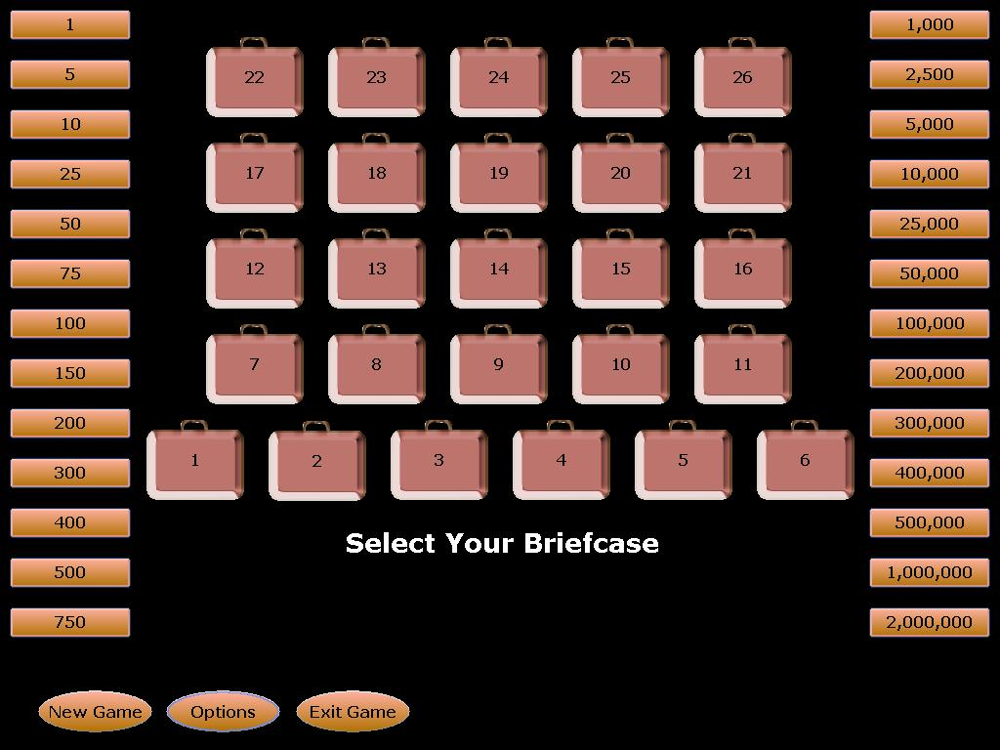



## Deal or No Deal

### Description

Deal or No Deal is one of the most successful gameshows on television and has already produced different versions in different countries. In Philippines, amounts of prices differ with other countries. The maximum amount to be won in this version is 2,000,000 unlike others having 1,000,000 which primarily depends on the currency.

Now, this game made in Visual Basic is for Thesis purposes and I decided to release it here in PSCode.

Some features of the game includes:

1. Real Formula for the Banker's Offers

2. Fully loaded with music and sound effects

3. Cool graphics (kinda)

4. Full options (about not included)

5. And lots more...

I would like to acknowledge 3 programmers who've I most likely appreciated because of their codes: LaVolpe, Bryan Cairns, and Gene Martynov. And most especially, I'd like to acknowledge Endemol for the idea of the game. Note that this application is not for sale, just for some enjoying purposes...&#252;

PS: After you download, please read README.txt...

For the OCX's, copy this link to your internet browser and press 'Enter' to begin download.&#252;. Then register these OCX's by running the application along with the .zip in the folder 'RegOCX'.&#252; And.. don't forget to vote!!!
 
### More Info
 

             |
---                |---
**Submitted On**   |2006-10-14 13:25:46
**By**             |[Ronald Borla](https://github.com/Planet-Source-Code/PSCIndex/blob/master/ByAuthor/ronald-borla.md)
**Level**          |Beginner
**User Rating**    |4.0 (16 globes from 4 users)
**Compatibility**  |VB 6\.0
**Category**       |[Games](https://github.com/Planet-Source-Code/PSCIndex/blob/master/ByCategory/games__1-38.md)
**World**          |[Visual Basic](https://github.com/Planet-Source-Code/PSCIndex/blob/master/ByWorld/visual-basic.md)
**Archive File**   |[Deal\_or\_No20249710142006\.zip](https://github.com/Planet-Source-Code/ronald-borla-deal-or-no-deal__1-66781/archive/master.zip)

